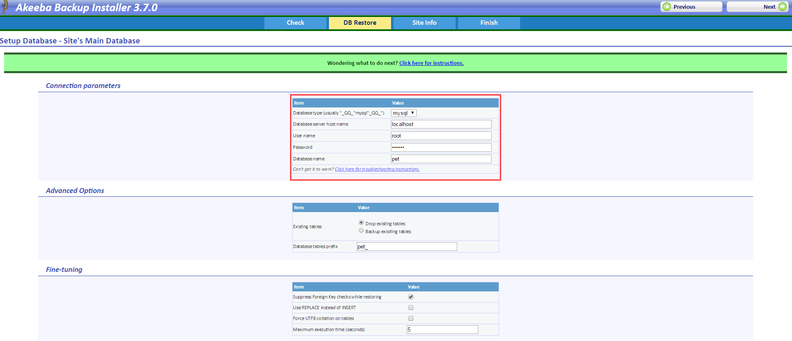

# pet
使用建站系统[Joomla](https://www.joomla.org/)搭建的宠物爱好者论坛。

# 部署方法一
* 搭建PHP运行环境，安装MySQL数据库

* 克隆本项目到Web根目录

* 新建`MySQL`数据库，导入数据库文件`pet.sql`

> 网站首页：localhost/pet
> 后台地址：localhost/pet/administrator
> 演示地址：[ff120.github.io/pet](ff120.github.io/pet)
> 测试用户名：admin
> 密码：123456
  
# 部署方法二
上述部署方法出现问题，无法修复，可以使用下述办法从打包好的文件部署，整个过程会提供Web界面配置必要的信息。
* 将目录下`installation2`更名为`isntallation`,在浏览器访问`localhost/pet/installation`
* 这时会出现一个check界面检查所需的环境是否都满足，单击右上角的`Next`
* 配置数据库连接信息，如下图
  
* 单击Next等待导入数据库成功，单击OK进入网站信息配置界面，配置好网站信息，进入Finish
* 将刚才的`installation`更名为`installlation2`
* 访问网站

